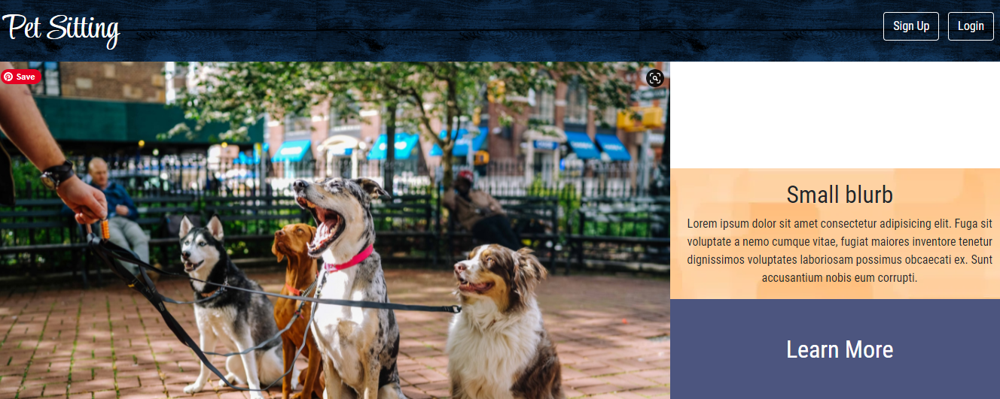

# Pet Sitting
Interactive Full-Stack Project
Coding Bootcamp Weeks 15 & 16

## Purpose
AS A pet owner
I WANT a secure platform
SO THAT I can find a pet sitter

AS A pet sitter
I WANT a secure platform
SO THAT I can find available jobs

## Deployed Website
[Check it Out]("https://rockstars-pet-sitter.herokuapp.com/")

GIVEN a functional front and back end website deployed through Heroku
I can sign up and login
To add pet sitting availablities or to find jobs
I can add, edit, and delete posts with images of my pet and reviews of my experoence as an owner or a pet-sitter

## Built With
* Express
* Sequelize
* Git Hub
* MySQL db
* Insomnia
* Heroku
* MVC

## Contribution
Made with ❤️ by Team Rock$tars (Samantha Malone, Nathan Pfu, and Chris Rose)
© 2021 Team Rock$tars. All rights reserved.
